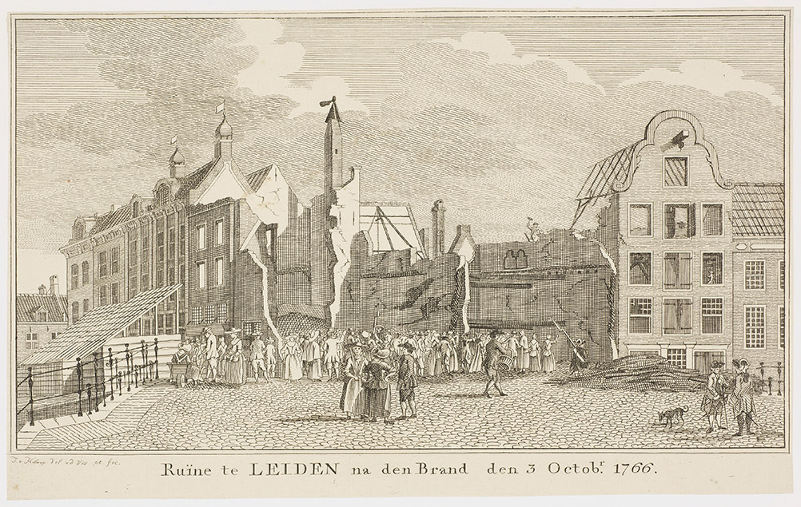

# Gebeurtenissen

Beeldbankitems zijn nu met personen, trefwoorden, tijd en plaatsen verbonden. Je zou daar gebeurtenissen aan toe kunnen voegen.

Neem de brand in de Hoogstraat op 3 oktober 1766. Daar zijn verschillende afbeeldingen van, en die zijn allemaal gemetadateerd met 'datum gebeurtenis' `1767`, de straat `Hoogstraat` en de trefwoorden `Brand` en `Gebeurtenissen`. De gebeurtenis die het betreft wordt alleen in titel en beschrijving genoemd. De enige manier om die afbeeldingen bij elkaar te bekijken is zoeken op 'brand Hoogstraat' en te filteren op periode '1766-1767'.

Op zo'n manier geautomatiseerd gebeurtenissen uit de beeldbank verzamelen, bijvoorbeeld om een tijdbalk te maken, is lastig, om niet te zeggen praktisch gezien ondoenlijk.

Om een beeld te krijgen van de typen gebeurtenissen die in de beeldbank voorkomen heb ik de eerste honderd gebeurtenissen verzameld, op datum oplopend, aan de hand van het trefwoord `Gebeurtenissen`. De [visualisatie daarvan](https://hicsuntleones.nl/elo/gebeurtenissen/) geeft een aardig beeld, al kunnen daar alleen de gebeurtenissen met rechtenvrije afbeeldingen getoond worden. De data (zowel alle gebeurtenissen als koppelingen met beeldbankrecords, al dan niet rechtenvrij) is te vinden in [events.ttl](events.ttl).

## Voordelen van het benoemen van gebeurtenissen

Binnen het huidige collectieregistratiesysteem is het lastig gebeurtenissen verder uit te bouwen voor gebruik bij metadatering. In de toekomst wordt dat misschien anders. Redenen om gebeurenissen uitvoeriger te modelleren:

- De gebeurtenis heeft plaats, tijd, type en actoren. Als je van een beeldbankrecord naar een gebeurtenis verwijst, hoef je al die dingen bij het record zelf niet meer op te nemen. Dat voorkomt redundantie als je bijvoorbeeld twintig afbeeldingen van een bepaalde brand hebt.
- Als gebeurtenissen daarbij zelf ook een titel hebben (en een eventuele beschrijving), dan is het eenvoudig om - bijvoorbeeld in educatieve projecten - tijdbalken, kaarten, etc. te maken.
- Als je voor plaatsen, typen en actoren gebruik maakt van Wikidata identifiers, dan hoef je zelf verder geen thesauri te onderhouden.
- Je kan aangeven dat een gebeurtenis onderdeel is van een 'grotere' gebeurtenis. Het ontzet van Leiden is onderdeel van het beleg van Leiden, het beleg van Leiden is onderdeel van de Nederlandse opstand.
- Gebeurtenissen kunnen ook goed verbonden worden met andere bronnen, zoals artikelen in het veelbezochte [krantenarchief](https://leiden.courant.nu/).