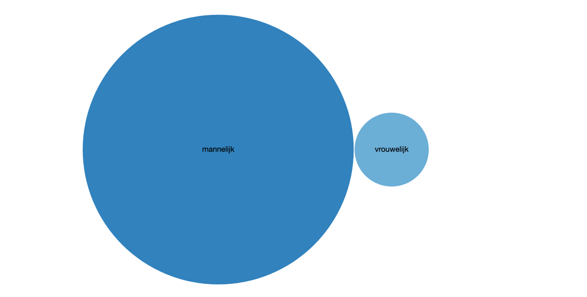
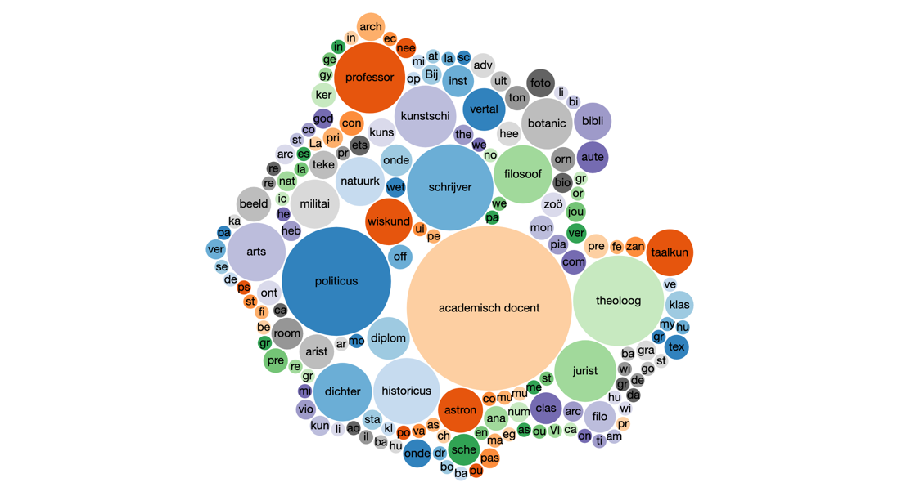
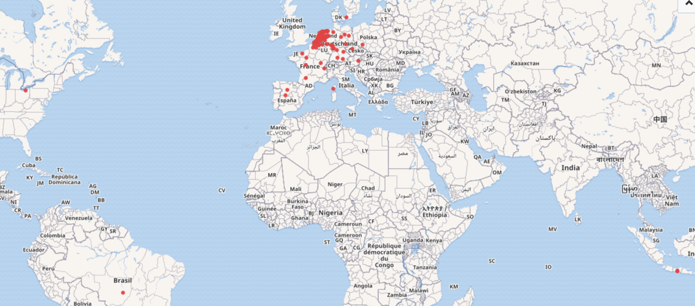
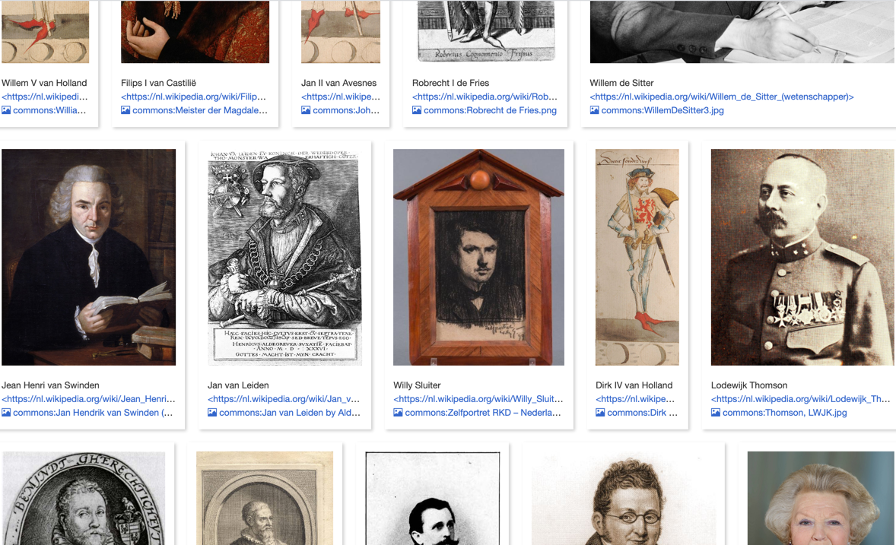

# Geportretteerden

De beeldbank bevat 1891 records waaraan zowel een persoon als het trefwoord 'portretten' gekoppeld is. Uniek gemaakt bleek het om 1006 personen te gaan. Daarvan konden er zo'n 300 scriptmatig met Wikidata personen gematched worden, al bleken er bij handmatig nalopen heel wat matches onterecht. Na die verwijderd te hebben bleven er 197 matches over.

De overige 809 personen zijn handmatig nagelopen, waarbij nog eens 177 personen met Wikidata items verbonden konden worden. Voor zestien personen die het nog niet tot Wikidata geschopt hadden maar toch 'notable' genoeg leken (mensen als [Willem Johannes Kret](https://www.wikidata.org/wiki/Q90008607), [Charles Marius Dozy](https://www.wikidata.org/wiki/Q91241073), [Catharina Hovens Gréve](https://www.wikidata.org/wiki/Q91748905), [François Was](https://www.wikidata.org/wiki/Q90046607)), is eerst een Wikidata item aangemaakt.

In totaal zijn zo dus [374 personen met Wikidata verbonden](geportretteerden.csv), en omdat sommige personen meermaals geportretteerd zijn gaat het om 935 portretten.

## Motivatie

- personen zijn ondubbelzinnig te identificeren
- personen zijn beter te verbinden met voorkomens van dezelfde persoon binnen of buiten de ELO collecties
- er komt een schat aan informatie beschikbaar, waarvan hieronder een paar voorbeelden
- als de beeldbankdata straks ook in ECHOES is opgenomen kunnen portretten geselecteerd en getoond worden op basis van die informatie (bijv. alle portretten van vrouwen die werkten aan de Universiteit Leiden)

## Voorbeelden

De man/vrouw verdeling vraagt wat aandacht:



Dat Leiden een universiteitsstad is, is in de beroepen van geportretteerden goed terug te zien:



De geportretteerden zijn vaak geboren in Nederland en de omliggende landen, maar een enkeling toch ook in Brazilië, Java of Cleveland.



Van de 374 zijn er 224 met een Wikipedia pagina. Daar zou je vanaf de beeldbank heen kunnen linken (of de tekst binnen je eigen website tonen).




## Voorbeeldquery

Wikidata is, net zoals ECHOES, met SPARQL te bevragen. Hieronder als voorbeeld de query die van de 374 personen alle personen ophaalt waarvan geboortedatum, geboorteplaats, overlijdensdatum en overlijdensplaats bekend zijn. Je kan de query kopiëren en draaien op de Wikidata SPARQLendpoint: [https://query.wikidata.org/](https://query.wikidata.org/)

```
SELECT ?person ?personLabel ?geb ?gebplaatsLabel ?sterf ?sterfplaatsLabel WHERE {
  VALUES ?person { wd:Q29574 wd:Q2356152 wd:Q1052638 wd:Q20113645 wd:Q2242334 wd:Q37361664 wd:Q2780011 wd:Q19937783 wd:Q2410665 wd:Q65850554 wd:Q54833604 wd:Q77140 wd:Q2000532 wd:Q5497009 wd:Q21170364 wd:Q560443 wd:Q313093 wd:Q20857379 wd:Q437466 wd:Q320980 wd:Q721355 wd:Q1229819 wd:Q15879779 wd:Q435886 wd:Q15451709 wd:Q358905 wd:Q1681876 wd:Q23062671 wd:Q983079 wd:Q737699 wd:Q471758 wd:Q1223864 wd:Q469671 wd:Q333346 wd:Q552234 wd:Q653110 wd:Q77250 wd:Q77248 wd:Q77243 wd:Q655190 wd:Q77251 wd:Q77256 wd:Q77255 wd:Q77245 wd:Q77249 wd:Q182028 wd:Q617496 wd:Q737820 wd:Q467019 wd:Q77244 wd:Q77253 wd:Q77247 wd:Q77252 wd:Q467007 wd:Q239337 wd:Q151120 wd:Q157073 wd:Q150726 wd:Q157098 wd:Q34417 wd:Q2442271 wd:Q30240975 wd:Q3138763 wd:Q1375186 wd:Q937 wd:Q117688 wd:Q27661925 wd:Q918731 wd:Q741901 wd:Q1696740 wd:Q15452550 wd:Q983340 wd:Q571426 wd:Q1465901 wd:Q15874908 wd:Q765465 wd:Q27651655 wd:Q1878874 wd:Q3370303 wd:Q2941097 wd:Q15454561 wd:Q15430814 wd:Q17190060 wd:Q2383589 wd:Q3476845 wd:Q109676 wd:Q1901030 wd:Q315163 wd:Q377100 wd:Q2063138 wd:Q21188759 wd:Q5296947 wd:Q1694832 wd:Q2767311 wd:Q15455831 wd:Q2079957 wd:Q78454 wd:Q339211 wd:Q2002089 wd:Q91648397 wd:Q2690729 wd:Q5598 wd:Q29885090 wd:Q150747 wd:Q779523 wd:Q28919973 wd:Q309861 wd:Q295099 wd:Q313059 wd:Q42750929 wd:Q65850329 wd:Q1356820 wd:Q15452564 wd:Q315871 wd:Q15453384 wd:Q90043457 wd:Q90008607 wd:Q19001519 wd:Q7192814 wd:Q2371807 wd:Q58335838 wd:Q23460082 wd:Q1939499 wd:Q23000114 wd:Q65851116 wd:Q19930374 wd:Q959236 wd:Q2212338 wd:Q4843509 wd:Q63003133 wd:Q164062 wd:Q91241073 wd:Q91015414 wd:Q630982 wd:Q2301250 wd:Q510116 wd:Q330188 wd:Q778131 wd:Q19329876 wd:Q21170358 wd:Q27863724 wd:Q938934 wd:Q2113241 wd:Q715659 wd:Q731829 wd:Q90046607 wd:Q28861873 wd:Q733070 wd:Q15445801 wd:Q21174842 wd:Q560622 wd:Q5320263 wd:Q15438278 wd:Q2605482 wd:Q2393246 wd:Q21545786 wd:Q2217735 wd:Q52155001 wd:Q18603420 wd:Q351161 wd:Q56229875 wd:Q9191 wd:Q13429927 wd:Q56231245 wd:Q56006893 wd:Q2668499 wd:Q1386569 wd:Q2335390 wd:Q80847 wd:Q924068 wd:Q56024253 wd:Q2780706 wd:Q14906465 wd:Q13738074 wd:Q2361300 wd:Q333372 wd:Q16853436 wd:Q7729 wd:Q18655249 wd:Q9263351 wd:Q3085667 wd:Q2933805 wd:Q2664419 wd:Q91764299 wd:Q89232852 wd:Q2989832 wd:Q91013100 wd:Q1351700 wd:Q19242002 wd:Q1960743 wd:Q540948 wd:Q59785834 wd:Q6688435 wd:Q91238121 wd:Q43133806 wd:Q27864010 wd:Q21553084 wd:Q5568715 wd:Q1382991 wd:Q2831550 wd:Q7730096 wd:Q4355142 wd:Q606737 wd:Q1429492 wd:Q15454952 wd:Q2245543 wd:Q1749935 wd:Q55902356 wd:Q18692847 wd:Q1891239 wd:Q65849211 wd:Q11862416 wd:Q15444806 wd:Q2732806 wd:Q2343861 wd:Q2344417 wd:Q2738369 wd:Q27645875 wd:Q56951928 wd:Q2104339 wd:Q83286695 wd:Q649457 wd:Q579591 wd:Q11715794 wd:Q1352440 wd:Q15449983 wd:Q4942587 wd:Q505004 wd:Q244152 wd:Q65849284 wd:Q2686047 wd:Q595507 wd:Q84993136 wd:Q55682753 wd:Q176206 wd:Q2304502 wd:Q65960805 wd:Q1974426 wd:Q194691 wd:Q55857482 wd:Q12777492 wd:Q445835 wd:Q56438563 wd:Q35802 wd:Q41688 wd:Q77085096 wd:Q15943583 wd:Q205863 wd:Q1986507 wd:Q77085257 wd:Q157888 wd:Q21546738 wd:Q2037521 wd:Q448016 wd:Q1692044 wd:Q27341877 wd:Q2137451 wd:Q90104860 wd:Q1133902 wd:Q23696 wd:Q2068933 wd:Q24917 wd:Q15078888 wd:Q711132 wd:Q77085422 wd:Q856831 wd:Q513159 wd:Q316996 wd:Q91585935 wd:Q2125168 wd:Q15444839 wd:Q3248130 wd:Q15445687 wd:Q15448697 wd:Q2499954 wd:Q21545920 wd:Q77084963 wd:Q57457015 wd:Q816612 wd:Q31621 wd:Q15440609 wd:Q57152108 wd:Q65851698 wd:Q77085530 wd:Q84594482 wd:Q320010 wd:Q2322545 wd:Q645696 wd:Q19801994 wd:Q15638114 wd:Q51934258 wd:Q2020165 wd:Q2460597 wd:Q18093655 wd:Q606757 wd:Q2502921 wd:Q19841037 wd:Q76261794 wd:Q497638 wd:Q2643774 wd:Q63258037 wd:Q1918340 wd:Q182509 wd:Q77084247 wd:Q606745 wd:Q1686957 wd:Q2308882 wd:Q2191599 wd:Q2799264 wd:Q27302290 wd:Q77085471 wd:Q20031949 wd:Q1692380 wd:Q1672202 wd:Q22690505 wd:Q22690534 wd:Q1342210 wd:Q67197990 wd:Q90914254 wd:Q2210094 wd:Q2800952 wd:Q65849317 wd:Q3945960 wd:Q1270730 wd:Q27278940 wd:Q4845184 wd:Q52154066 wd:Q21535084 wd:Q313070 wd:Q2364614 wd:Q29168307 wd:Q91768456 wd:Q62517 wd:Q2793027 wd:Q24085 wd:Q13738067 wd:Q43499 wd:Q18093540 wd:Q90919714 wd:Q4684778 wd:Q4026596 wd:Q91013140 wd:Q2670000 wd:Q21544880 wd:Q2061272 wd:Q60725 wd:Q430783 wd:Q2050930 wd:Q1976345 wd:Q2032710 wd:Q91748905  } .
  ?person wdt:P569 ?geb .
  ?person wdt:P19 ?gebplaats .
  ?person wdt:P570 ?sterf .
  ?person wdt:P20 ?sterfplaats .
  SERVICE wikibase:label { bd:serviceParam wikibase:language "[AUTO_LANGUAGE],en". }
}
```
