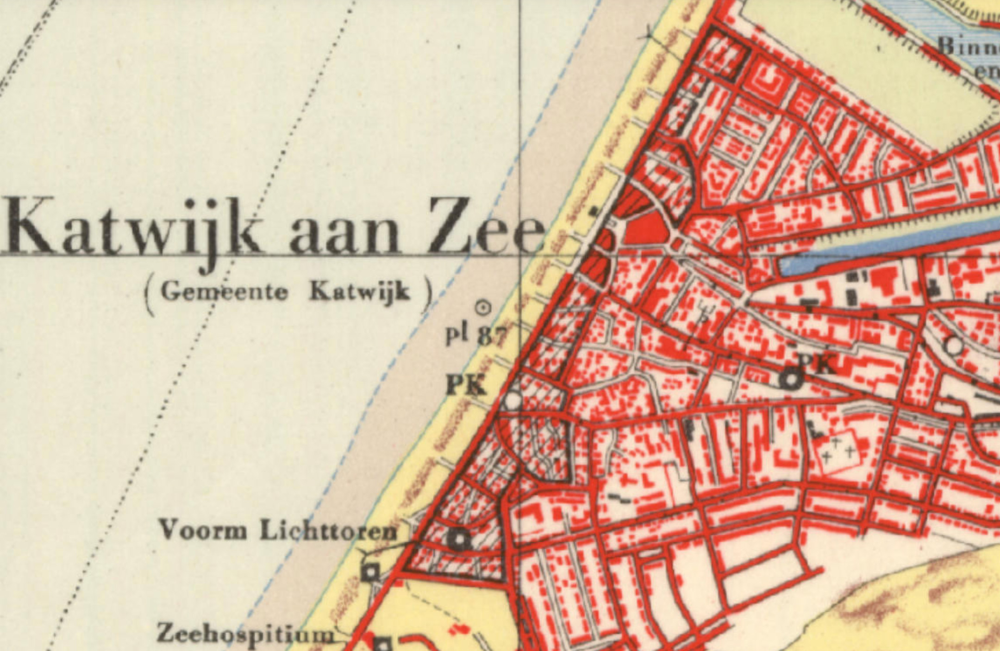
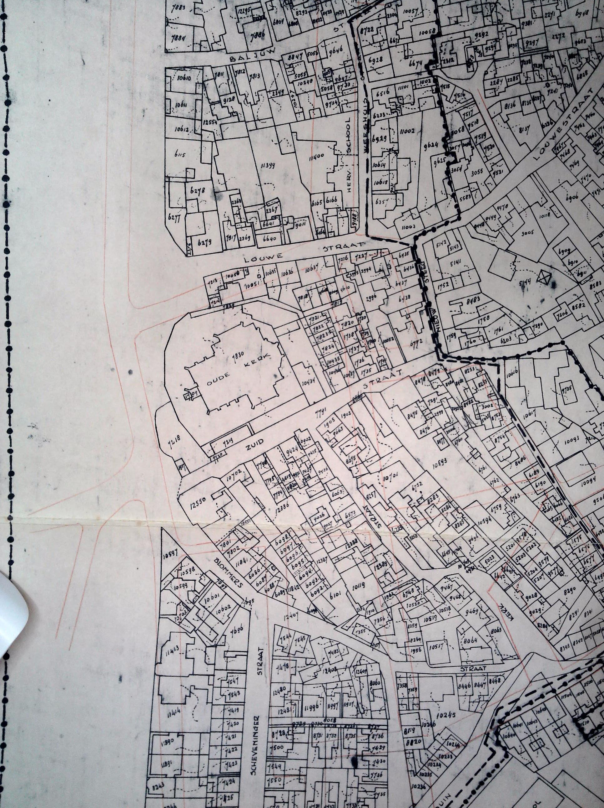

# Straten in Katwijk

Hier vind je (binnenkort) naamvarianten en schrijfwijzes van Katwijkse straatnamen, zoals die zijn aangetroffen in Katwijkse politierapporten uit de oorlogsjaren.

## Atlantikwall

In de oorlogsjaren is de hele Katwijkse kuststrook [gesloopt](https://katwijkinoorlog.nl/de-huizensloop-in-het-kustgebied/) om de Atlantikwall aan te leggen. Na de oorlog is het oorspronkelijke stratenplan deels teruggekomen, maar er zijn ook een aantal straten verdwenen. Het stratenplan van voor de sloop is [hier als geojson](atlantikwall-stratenplan.geojson) te vinden.

Het gearceerde deel op deze kaart, ook te bekijken op [Topotijdreis](https://topotijdreis.nl/kaart/1951/@87160,468830,10.94), is in de periode 1943-1944 gesloopt.

Dankzij een aantal kaarten, zoals die hieronder, die ik van het Katwijks Museum gemaild kreeg kon ik de ligging van de meeste van die straten achterhalen.

Deel van het gesloopte stuk van Katwijk. Bekijk voor de alle delen de kaarten [kaart 1](kaart1.jpg), [kaart 2](kaart2.jpg), [kaart 3](kaart3.jpg), [kaart 4](kaart4.jpg), [kaart 5](kaart5.jpg) in deze map.
