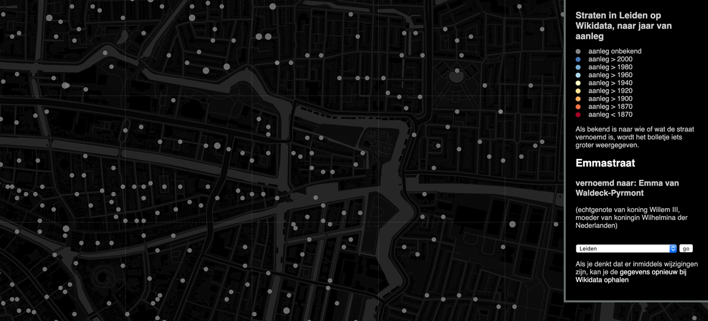
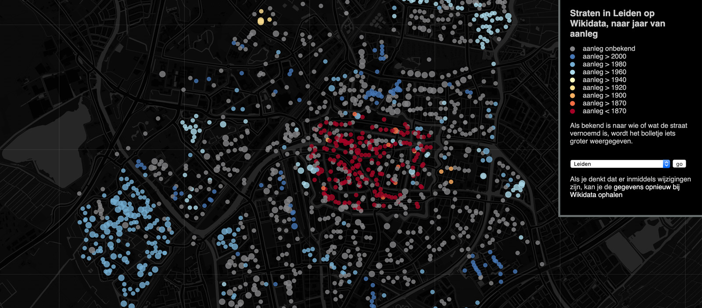

# Straten

Op Wikidata zijn zo goed als alle straten binnen de gemeente Leiden te vinden. Ze zijn daar vrijwel allemaal van [BAG](https://nl.wikipedia.org/wiki/Basisregistratie_Adressen_en_Gebouwen) id en grotendeels ook van coördinaten voorzien.

Als collectie-items (via de interne locatiethesaurus bijvoorbeeld) met die Wikidata straten verbonden zijn, hebben we onder andere toegang tot vernoemingen, periode van bestaan en alternatieve straatnamen.

Vernoemingen en dateringen kunnen in Wikidata ook ingegeven worden. Op de kaart hieronder zie je dat er op moment van schrijven (mei 2020) nog geen enkele datering bekend is. Wel zijn er 163 vernoemingen bekend.

De kaart toont bij aanvang van dit projectje (mei 2020) nog geen enkele datering en 163 vernoemingen. Je kunt [de kaartapplicatie bekijken](https://www.hicsuntleones.nl/straten/?gemeente=Q43631) om te zien wat de laatste stand van zaken is.

## Vernoemingen

Met de property `P138` (vernoemd naar) geef je aan waar een straat naar vernoemd is. Kijk bijvoorbeeld bij het [Amsterdamse Jofferpad](https://www.wikidata.org/wiki/Q18935260), daar zie je hoe die property gebruikt wordt om aan te geven dat de straat vernoemd is naar de [Amsterdamse Joffers](https://www.wikidata.org/wiki/Q3515741), een Nederlandse groep vrouwelijke kunstenaars in de 19e eeuw.

## Periode van bestaan

De datum waarop de fysieke straat is aangelegd geef je aan met de property `P571` (datum van oprichting of creatie). Mocht je een slag om de arm willen houden, dan kan je zo'n datum een precisie van een jaar, decennium, eeuw of desnoods een millenium meegeven. En vervolgens kan je met een 'qualifier' ook nog aangeven wat bijvoorbeeld binnen die eeuw de laatstmogelijke datum is. Handig als je niet precies weet wanneer een straat is aangelegd, maar wel een eerste vermelding hebt - zoals we bijvoorbeeld bij de [Oosterkerkstraat](https://www.wikidata.org/wiki/Q19395577) weten dat die in 1659 in een bron vermeld wordt als 'Kercsteech'.

Het is netjes om bij zo'n 'datum-van-oprichting-bewering' een bron te geven. Dat kan met `P248` ('vermeld in'). Het helpt als de bron al over een eigen Wikidata item beschikt - kandidaten zijn bijvoorbeeld:

- [Database Geschiedenis Leidse Straatnamen](https://www.wikidata.org/wiki/Q95992074), die te raadplegen is op [online.leiden.nl/straatnaam/](https://online.leiden.nl/straatnaam/)
- Het boekje [Gedemptegrachtenwandeling](https://www.wikidata.org/wiki/Q54925463)
- Het [Leids Jaarboekje](https://www.wikidata.org/wiki/Q2486316), waarbij je met een aparte qualifier ook aan kunt geven om welk deel het gaat (zoals je ook kunt aangeven om welke pagina het gaat)
- Het onlangs verschenen [Straatnamen in Leiden](https://www.wikidata.org/wiki/Q96031403)

[Verdwenen straten](https://w.wiki/Soq) hebben niet alleen een 'datum van oprichting of creatie', maar ook een `P576` (datum van opheffing), zoals het geval is bij de [Zijdgracht](https://www.wikidata.org/wiki/Q32853176).

## Alternatieve namen

Een Wikidata item kan in verschillende talen een label, een beschrijving en alternatieve labels ('ook bekend als') hebben. De Oosterkerkstraat heeft als alternatieve labels 'Kerksteeg' en 'Waardkerksteeg'.

Het is niet de bedoeling om allerlei spellingsvarianten als alternatief label aan Wikidata toe te voegen. Dat kan [verschrikkelijk uit de hand lopen](https://adamlink.nl/geo/street/sint-antoniesbreestraat/4096). Een variant als 'Kercsteech' zullen we dus in een eigen databestand op moeten slaan (waarbij we natuurlijk wel naar het Wikidata item verwijzen).

Bij hernoemingen bij raadsbesluit kunnen we de property `P1448` (officiële naam) gebruiken. Het [Van der Sterrepad](https://www.wikidata.org/wiki/Q54935213) heette tot 1980 Burchtheuvelpad en daarvoor, tot 1917, Burchtgracht. Bij een officiële naam kan je ook begin- en of einddatum opgeven.

## Geometrie

Wikidata items kunnen een 'geografische locatie' (property `P625`) hebben. Op het moment van schrijven zijn er nog [286 straten zonder geometrie](https://w.wiki/Sos). Dit zijn vooral in het kader van dit project toegevoegde recent aangelegde straten en 'paden' die tot dusver buiten de boot waren gevallen omdat er bij de landelijke import alleen straten met adressen zijn meegenomen.

Om handmatig een geometrie te achterhalen kan je gebruik maken van een tooltje als [latlong.net](https://www.latlong.net/), waar je eenvoudig een punt kunt prikken en de coördinaten kopiëren.

## Relaties tussen straten

Bij een hernoeming is er geen reden om een nieuwe straat aan te maken. Aan de fysieke straat zelf verandert dan immers niets. Soms ligt dat anders, bijvoorbeeld als verschillende straten worden samengevoegd tot een nieuwe straat of een straat in meerdere nieuwe straten wordt gesplitst. Of als er een nieuwe straat wordt aangelegd die min of meer het traject van een oude straat volgt, maar daar toch op de één of andere manier van afwijkt.

Dat laatste is bijvoorbeeld het geval bij de [Paardensteeg](https://www.wikidata.org/wiki/Q96050029), waarvan de bebouwing aan één zijde werd gesloopt om de tram doorgang te geven. De 'nieuwe' straat over hetzelfde traject is de huidige [Prinsessekade](https://www.wikidata.org/wiki/Q19435027).

In zo'n geval kunnen we de property `P1366` (vervangen door) en het tegenovergestelde `P1365` (vervangt) gebruiken. Als een straat gesplitst wordt in meerdere straten geef je bij 'vervangen door' meerdere waardes.

De kaart met dateringen zoals die er begin juni 2020 uitzag.

